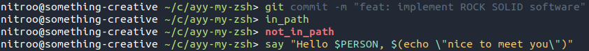

# Ayy My ZSH!

It's about time I move on from [Oh My ZSH!](https://ohmyz.sh/). It was always a bit more than I've needed, so I decided to reimplement something lightweight with the features I rely on most.
* Oh My ZSH! history configuration.
* A Fish-like prompt.
* Some basic plugins like [zsh-autosuggestions](https://github.com/zsh-users/zsh-autosuggestions) and [zsh-syntax highlighting](https://github.com/zsh-users/zsh-syntax-highlighting).



## Installation

Download and run the installation script
```console
$ curl "https://raw.githubusercontent.com/nitroo/ayy-my-zsh/master/install.sh" | sh
```

or just download the folder somewhere and source the files!
```console
$ source "$MY_FANCY_DIR/ayy-my-zsh/ayy-my-zsh.zsh"
```

## Development & Contribution

You can test out the code by executing the `test/run` script.
```console
$ zsh test/run
```

The goal of this little utility is to stay simple. If you find any issues, or if you've got an idea for a useful feature, your feedback would be appreciated. Please feel free to take this code and run with it.
